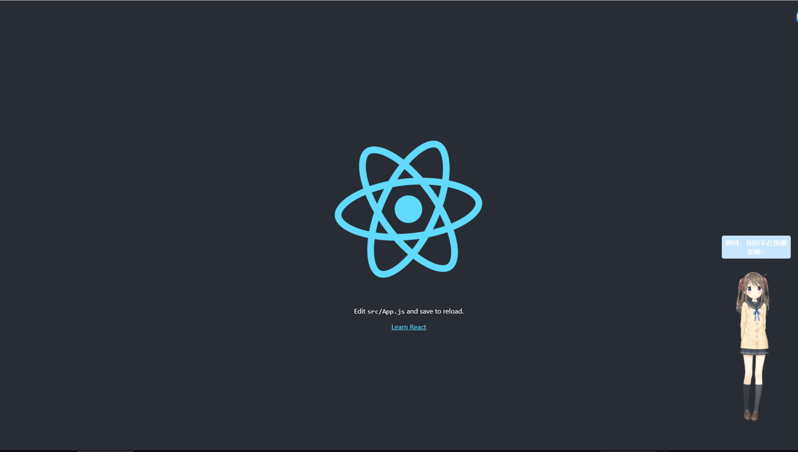

<h1 align="center">react-live2d</h1>


[示例地址](http://test2.supmiao.com)



示例服务器配置较差，网站首次打开，看板娘需要加载较大的皮肤纹理高清图，请耐心等候


## 目录说明

```
·
├─ Core                         # Cubism Core 核心库

└─ Samples                      

   └─ TypeScript

      └─ Demo                   # 项目目录

         └─ Resources           # live2D的模型及动作导出的文件

         └─ Framework           # 包含渲染和动画功能等的源代码

         └─ src                 # 核心代码
```

## 🖥 Environment Support
|  | Windows | macOS | Linux | Android | iOS |
| ----- | :-----: | :-----: | :-----: | :-----: | :-----: |
| Google Chrome | ✔ | ✔ | ✔ | ✔ | ✔ |
| Firefox | ✔ | ✔ | ✔ | ✔ | ✔ |
| Safari | - | ✔ | - | - | ✔ |
| Microsoft Edge | ✔ | ✔ | - | ✔ | ✔ |
| Internet Explorer 11 | ✔ | - | - | - | - |

## 📦 Install

```bash
npm install react-live2d
```


## 🔨 Usage for SPA
#####  如：create-react-app


基础包直接使用script引入，在你个人的react项目的->public->index.html先插入，Core里可获得该min.js
```
<script src = "http://publicjs.supmiao.com/live2dcubismcore.min.js"></script>
```

```jsx
import ReactLive2d from 'react-live2d';

const App = () => (
  <>
    <ReactLive2d
        width={300}
        height={500}
    />
  </>
);
```

比如你想要给页面加入模型Hiyori，那就在你的react项目中的public目录下，将Hiyori放入Resources资源文件夹,如

```
·
└─ public                     

   └─ Resources

       └─ Hiyori
```


## 🔨 Usage for SSR
#####  如：create-next-app

创建文件`./pages/_document.js`
```jsx
import Document, { Html, Head, Main, NextScript } from 'next/document'

class MyDocument extends Document {
  static async getInitialProps(ctx) {
    const initialProps = await Document.getInitialProps(ctx)
    return { ...initialProps }
  }

  render() {
    return (
      <Html>
        {/* <Head /> */}
        <Head>
          <script src = "http://publicjs.supmiao.com/live2dcubismcore.min.js"></script>
        </Head>
        <body>
          <Main />
          <NextScript />
        </body>
      </Html>
    )
  }
}

export default MyDocument
```

```jsx
import dynamic from 'next/dynamic'

const ReactLive2d = dynamic(import('react-live2d'), {
  ssr: false
})

export default function Home() (
  <>
    <ReactLive2d
      width = { 300}
      height = { 500}
      bottom = { '10px'}
      right = { '10px'}
      ModelList = { ['Haru']}
      TouchBody = { ['啊啊啊啊啊你要干嘛', '哼', '坏人']}
      PathFull='http://publicjs.supmiao.com/Resources/'
    />
  </>
);
```

SSR使用看板娘需要允许跨域的资源域名，nginx参考配置如下：
```
server {　　 
    ....
    add_header Access-Control-Allow-Origin *;
    add_header Access-Control-Allow-Methods 'GET,POST';
    add_header Access-Control-Allow-Headers 'DNT,X-Mx-ReqToken,Keep-Alive,User-Agent,X-Requested-With,If-Modified-Since,Cache-Control,Content-Type,Authorization';  
}
```

## 🌍 More Model
最新的SDK是支持moc3格式的模型，并且官方以后保证了新版本也向前兼容（除了2以前的）。
所以使用的大大们记得使用时去寻找moc3模型^ ^
如何辨别是moc3格式模型：


个人用以收集、学习的moc3格式[仓库](https://github.com/chendishen/live2d-model)

更多模型，请动手在github搜索'live2d 模型'即可，模型注意版权，请勿用于商业用途~

api 文档 （待完善，如有需要功能欢迎提[issue](https://github.com/chendishen/Live2DBase/issues)）

| 成员 | 说明 | 类型 | 默认值 |
| :-----: | ----- | ----- | ----- |
| width | 盒子宽度 | Number | 300 |
| height | 盒子高度 | Number | 500 |
| top | position：relative的top值 | String | '' |
| right | position：relative的right值 | String | '0' |
| bottom | position：relative的bottom值 | String | '0' |
| left | position：relative的left值 | String | '' |
| ModelList | 模型列表 | Array<String> | ['Hiyori'] |
| TouchBody | 点击身体时聊天框随机出现数组的值,该值当模型未存入身体触摸事件时无效 | Array<String> | ['啊呀，你的手在摸哪里嘛~','哼，坏人'] |
| TouchHead | 点击头部时聊天框随机出现数组的值,该值当模型未存入头部触摸事件时无效 | Array<String> | ['讨厌,不要掐人家的脸嘛~','希望明天也能感受到你的触摸呢'] |
| TouchDefault | 点击盒子任意位置时聊天框随机出现数组的值,该值所有模型均有效且优先级最低 | Array<String> | ['今天又是开心的一天呢~','真是元气满满呀'] |
| color | 聊天框背景颜色 | String | '#C8E6FE' |
| PathFull | 当SSR框架时，必须传入此参数，用以额外指定绝对路径资源域名地址；当SPA框架时，目录较深的页面也可以根据自己需要，设置该参数指向正确的路径，如'../Resources/' | String | '' |
| MobileShow | 是否在移动设备展示看板娘 | Boolean | false |
| menuList | 启用的功能菜单列表，该值传空数组时不启用菜单，可用参数为：Mtab | Array<String> | ['Mtab'] |


当menuList 传入非空数组时，其中的字段：
| 成员 | 说明 | 类型 | 默认值 |
| :-----: | ----- | ----- | ----- |
| Mtab | 切换看板娘 | String | 'Mtab' |
